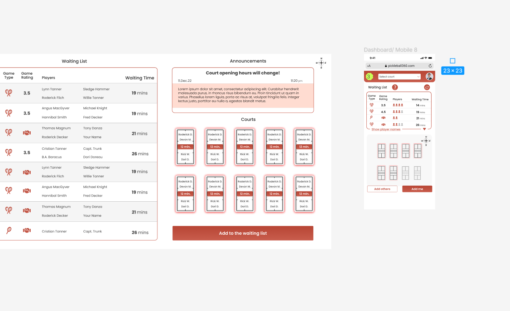
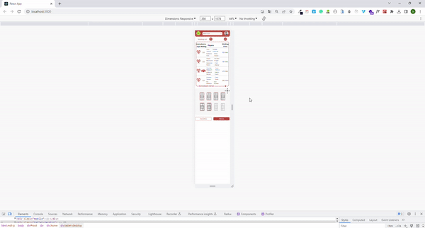

# Hiring Task
* I should create this page 👇

## Description
I have created two responsive pages for mobile and desktop as designed in Figma design. Codes created with a mobile-first approach. API operations were simulated on localhost:5000 port. POST and GET operations done. 

## Project Skeleton

```


├── backend
│     └── api
│          └── data.json
├── cypress
│    ├── downloads  
│    ├── e2e
│    │     ├── addList.cy.js
│    │     └── mobil.cy.js
│    ├── fixture
│    │     └── example.json
│    └── support
│    │     ├── commands.js
│    │     └── e2e.js
├── public
│     └── index.html
├── src
│    ├── components
│    │     ├── announcements
│    │     |        ├── model
│    │     |        |    ├── addList.css
│    │     |        |    └── AddList.jsx
│    │     |        ├── announcements.css
│    │     |        ├── Announcements.jsx
│    │     |        ├── court.css
│    │     |        └── Court.jsx
│    │     ├── mobil
│    │     |        ├── button
│    │     |        |    ├── button.css
│    │     |        |    └── Button.jsx
│    │     |        ├── court
│    │     |        |    ├── court.css
│    │     |        |    └── Court.jsx
│    │     |        ├── navbar
│    │     |        |    ├── navbar.css
│    │     |        |    └── Navbar.jsx
│    │     |        ├── waitingList
│    │     |        |    ├── table.css
│    │     |        |    ├── Table.jsx
│    │     |        |    ├── waitingList.css
│    │     |        |    └── WaitingList.jsx
│    │     |        ├── mobileSection.css
│    │     |        └── MobileSection.jsx
│    │     └── waitingList
│    │             ├── table.css
│    │             ├── Table.jsx
│    │             ├── waitingList.css
│    │             └── WaitingList.jsx
│    ├── pages
│    │     └── Home.jsx
│    ├── styles
│    │     ├── global.css
│    │     └── home.css
│    ├── App.js
│    └── index.js
├── package.json
├── cypress.config.js
├── .gitignore
└── yarn.lock
```

## How to run your local?

__To run this project in your own locale, follow the steps below.__

1. Clone the project to your local by typing the following command in the terminal.

- git clone https://github.com/HakanCava/taskForHiring.git

2. Then install the node_modules and files in the package.json by typing __*yarn*__ command in the terminal.

3. Run the project at localhost:3000 with __*yarn start*__ command.

4. Type the following command in terminal for backend:

### npx json-server --watch backend/api/data.json --port 5000
- With this command, the backend server will run on the port http://localhost:5000/waiting-list.

- I can dynamically perform GET and POST operations in our project.

## Gif
- This is gif 👇😊


**<p align="center">&#9786; Happy Coding &#9997;</p>**